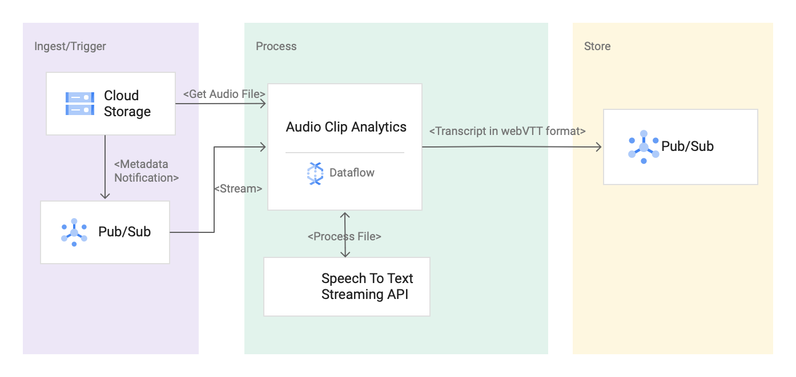

# Automatic WebVTT Caption From Streaming STT API By Using Dataflow
This repo contains a reference implementation to capture caption in [WebVTT](https://en.wikipedia.org/wiki/WebVTT) format by processing <b>interim response</b> received from streaming STT(SpeechToText) API. The goal is to provide an easy to use automated solution to process audio clips  in real time by using GCS, PubSub and Dataflow. 

## Table of Contents  
* [Context](#context).  
* [How It Works](#how-it-works).   
* [Reference Architecture](#reference-architecture).
* [Before Start](#build-run).  
* [Build & Run ](#build-run). 
* [Test ](#test ). 

## Context
If you are looking to capture web VTT caption in real time, there are couple of challenges to overcome:
- Latency has to be optimal which requires enabling interims result in STT  streaming API.
- Construct start and end time offset based on the result_end_time field from the interims result returned.
- Determine when/how to emit the output.  This pattern uses 'number of words' and removes repeated words from the transcript. 

## How It works?
1. Pipeline receives notification in a PubSub topic to process an audio clip. 
2. Pipeline calls the streaming STT api to process the clip.
3. Pipeline receives the response and emit the result by taking following steps:
	* Display the transcript that only meets a higher stability floor. It can be configured by using --stability parameter. By default it's set to 0.8.
	* Count the number of words by splitting the transcript. 
	* By using state variable, keep tracking lastEmitWordCount and startTime.
	* Skipping the words already displayed from lastEmitWordCount and compare currentWordCount>=maxWordCount (configured by --wordCount parameter)
	* Setup new start and end time from result_end_time value. Assume 00:00:00 is the start offset.
4. Group by file name and construct webVTT format.
5. Publish to a PubSub topic.
## Reference Architecture
 
## Before Start
1. Enable some Google Cloud APIs:

```
gcloud services enable dataflow.googleapis.com containerregistry.googleapis.com speech.googleapis.com
```

2. Set some environment variables (replace values with your project ID and preferred region):

```
export PROJECT=[PROJECT]
export REGION=[REGION]
```

3. Create two buckets, one to store input video files and another one to store Dataflow Flex template config files:
```
export AUDIO_CLIPS_BUCKET=${PROJECT}_videos
export DATAFLOW_TEMPLATE_BUCKET=${PROJECT}_dataflow_template_config
gsutil mb -c standard -l ${REGION} gs://${AUDIO_CLIPS_BUCKET}
gsutil mb -c standard -l ${REGION} gs://${DATAFLOW_TEMPLATE_BUCKET}
```

4. Create required topics and subscriptions as below

```
export GCS_NOTIFICATION_TOPIC="gcs-notification-topic"
export GCS_NOTIFICATION_SUBSCRIPTION="gcs-notification-subscription"
export STT_TRANSCRIPT_TOPIC="object-detection-topic"
export STT_TRANSCRIPT_TOPIC_SUBSCRIPTION="stt-transcript-subscription"
gcloud pubsub topics create ${GCS_NOTIFICATION_TOPIC}
gcloud pubsub subscriptions create ${GCS_NOTIFICATION_SUBSCRIPTION} --topic=${GCS_NOTIFICATION_TOPIC}
gcloud pubsub topics create ${STT_TRANSCRIPT_TOPIC_TOPIC}
gcloud pubsub subscriptions create ${STT_TRANSCRIPT_TOPIC_SUBSCRIPTION} --topic=${STT_TRANSCRIPT_TOPIC_TOPIC}
```


## Build & Run

Gradle Build

```
gradle spotlessApply
gradle build
```

Gradle Run

```
gradle run -DmainClass=com.google.solutions.df.stt.autocaption.STTAutoCaptionPipeline -Pargs="--streaming \
--runner=DataflowRunner \
--project=${PROJECT_ID} \
--autoscalingAlgorithm=THROUGHPUT_BASED \
--workerMachineType=n1-standard-4 \
--numWorkers=1 \
--maxNumWorkers=3 \
--outputTopic=${STT_TRANSCRIPT_TOPIC} \
--inputNotificationSubscription=${GCS_NOTIFICATION_SUBSCRIPTION} \
--region=us-central1  \
--wordCount=42
```

## Test
Test Clip 
```
gs://dataflow-stt-audio-clips/wav_mono_kellogs.wav
```
Output with word count =22

```
 00:00:00-->00:00:11
Now class mr. Tiger will show us how Kellogg sugar Frosted Flake cereal starts out. This are flake-free. It's a cornfield Kellogg's 
00:00:11-->00:00:17
toast corn the golden Flakes and adds a secret frosting helps keep an extra crunchy and delicious. It's part of your good breakfast 
00:00:17-->00:00:18
and
```

Output with word count =10

```
00:00:00-->00:00:05
Now class mr. Tiger will show us how Kellogg sugar Frosted 
00:00:05-->00:00:09
Flake cereal starts out. This are flake-free. It's a cornfield 
00:00:09-->00:00:13
Kellogg's toast corn the golden Flakes and adds a secret 
00:00:13-->00:00:17
frosting helps keep an extra crunchy and delicious. It's part of 
00:00:17-->00:00:18
your good breakfast and 
```


